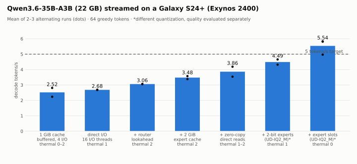
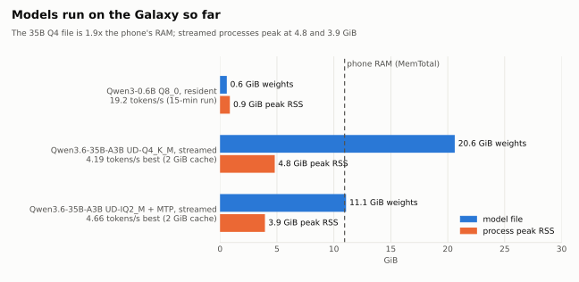

<p align="center"></p>

# Equity (eqt)

**Equity runs language models that do not fit in a phone's RAM — on the phone, offline, at usable speed.**

It is a research inference engine specialised in one model family, the **Qwen3.5/3.6 hybrid-attention mixture-of-experts models**, on one first device, a stock **Samsung Galaxy S24+ (Exynos 2400, 10.9 GiB visible RAM)**. No root, no cloud, no account, no telemetry. Weights stay on the phone's storage and the engine reads only the experts each token needs.

## What is true today

All numbers are measured on the Galaxy and recorded in [`results/`](results/).

- **A model twice the phone's RAM runs.** Qwen3.6-35B-A3B (UD-Q4_K_M, 22.7 GB) and its 2.7-bit UD-IQ2_M build (11.9 GB) stream on a stock phone with a peak RSS of about 4.7 GiB. Routing is exact: streamed inference is bitwise identical to resident inference on the verification fixtures.
- **Over 5 tokens/s in short runs.** UD-IQ2_M decodes at 5.5 tokens/s on average (5.8 at best) over 64 tokens on a cool phone.
- **About 3.5 tokens/s sustained.** Over 10 minutes on battery, the phone's stock thermal management settles decode at about 3.5 tokens/s, at about 1.07 J per token.
- **Quality held on a first check.** On a 27-item, automatically checked set (Italian, instructions, reasoning, code, knowledge, long context), UD-IQ2_M and UD-Q4_K_M both score 26/27, and the 2.7-bit build is about 33% faster. The set is small, so UD-Q4_K_M stays the reference.
- **Long context works.** Context is limited only by the model (262,144 tokens). A 7,857-token needle-in-a-haystack prompt is answered correctly, and a 3,803-token prompt prefills in 164 s, down from 522 s.
- **Optimizations are exact.** Every speedup is either bitwise exact or differs only in float rounding (at most 3.4·10⁻⁷ relative), and is A/B-tested with identical output tokens. The 5 tokens/s *sustained* goal is an experimental target, not a promise; quality and context are never traded for speed.

<picture>
  <source media="(prefers-color-scheme: dark)" srcset="docs/figures/decode-progress-dark.svg">
  
</picture>

| Prompt processing, UD-IQ2_M | Before | Now |
|---|---|---|
| 52-token chat prompt | 5.78 s | 3.95 s |
| 3,803-token prompt | 521.6 s | 164.4 s |

## How it works

- **Shared weights stay resident; experts stream.** About 1.7–2.4 GiB of attention and shared weights stay in RAM. Routed experts, 9–19 GB, are read with direct I/O into a bounded cache of reusable, page-aligned slots. GGML's expert matrix product finds each expert's slot through a hook added by Equity. Reloads take no page faults.
- **Prediction and overlap.** A lookahead router prefetches the next layer's experts while the current layer computes. Prompt batches read adjacent experts in single coalesced reads and load whole layers ahead.
- **Kernels for this CPU.**
  - Decode and speculative verification use exact 2×2 dotprod tiles.
  - Prompts use GGML's tiled GEMM, enabled on ARM with Equity's own i8mm microkernel.
  - Attention uses a NEON GEMM where GGML's SVE builds fell back to scalar code.
  - The right ISA variant is picked at runtime.
- **Stock Android only.** No root, no thermal overrides; model acquisition is an explicit step.

<picture>
  <source media="(prefers-color-scheme: dark)" srcset="docs/figures/models-dark.svg">
  
</picture>

## Documents

| | |
|---|---|
| [Progress and next steps](docs/progress.md) | Session log, current state, the plan to resume from |
| [Decisions](docs/decisions.md) | Every design choice with its measurements, including negative results |
| [Benchmark protocol](docs/benchmarking.md) | How speed, quality and energy are measured |
| [Research ledger](docs/research.md) | Literature, hypotheses and how they were tested |
| [Third-party notices](THIRD_PARTY_NOTICES.md) | Licenses of dependencies and fonts |

## Build and run

Prerequisites (Windows): Git, Python 3.12, Android SDK 36, NDK `28.2.13676358`, SDK CMake `3.22.1`, JDK 17+, `ANDROID_HOME`, and ADB on PATH. Dependencies are pinned in `dependencies.json`, and `scripts/bootstrap.ps1` checks llama.cpp against its recorded patches.

```powershell
# App: build and install over (wireless) ADB; models live in the app's private storage
./scripts/android-app.ps1 -Variant Debug -Install -Serial <ip:port>

# Native engine and CLI tools
./scripts/build.ps1 -Target Android
python tools/verify_streaming.py --target android --direct-io   # bitwise streamed-vs-resident checks
python tools/eval_quality.py run --target android --model <device path> --output <file>
python tools/sustained_run.py --model <device path> --load '{...}' --output <file>
```

Inference is offline. Acquiring weights is an explicit operation (`tools/acquire_model.py`, or the app's resumable download). Builds never download models.

## Acknowledgements

Equity builds on [llama.cpp and GGML](https://github.com/ggml-org/llama.cpp) by Georgi Gerganov and contributors, pinned with two recorded patches. The streaming design was informed by [DwarfStar/ds4](https://github.com/antirez/ds4) by antirez and by published work on expert offloading. Model weights belong to their publishers under their own licenses. Development is AI-assisted; every claim is tied to a measurement record.

## License & Commercial Licensing

This project is dual-licensed:

1. **Open Source (AGPLv3):** Free for personal use, education, and open-source projects. Under the **GNU AGPLv3**, any modified version or service integrating this software must also release its source code publicly under the same AGPLv3 license.
2. **Commercial License:** If you wish to use this software in proprietary/closed-source products, SaaS platforms without releasing your source code, or require custom enterprise terms, you must purchase a commercial license.

For commercial licensing requests, contact: **z3tawave@gmail.com**
